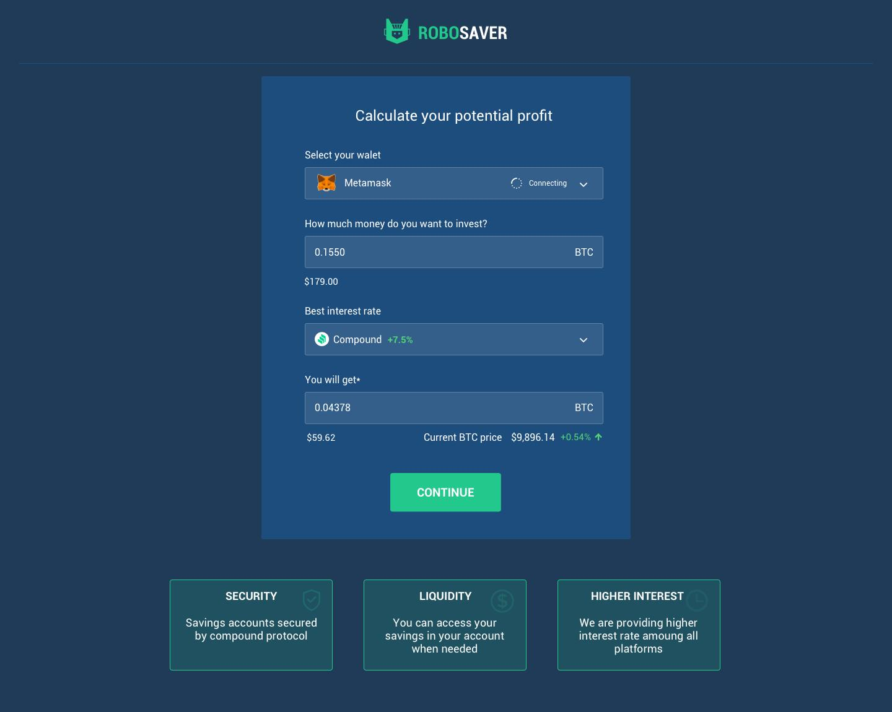

This project was bootstrapped with [Create React App](https://github.com/facebook/create-react-app).

## Intro

Robosaver is a DeFi app on Ethereum that aggregates rates from different Decentralized Financial protocols such as Compound, and auto-rebalances user accounts to provide them highest earning interest rate. The app finds the highest interest rate and easily swaps the user's Bitcoin into tBTC and then into the currency that is yielding the most returns while depositing the funds for them in Compound. Robosaver won 2nd place in the Compound Finance & Keep bounty at ETHDenver 2020.

## Available Scripts

In the project directory, you can run:

### `yarn start`

Runs the app in the development mode. 
Open [http://localhost:3000](http://localhost:3000) to view it in the browser.

The page will reload if you make edits. 
You will also see any lint errors in the console.

### `yarn test`

Launches the test runner in the interactive watch mode. 
See the section about [running tests](https://facebook.github.io/create-react-app/docs/running-tests) for more information.

### `yarn build`

Builds the app for production to the `build` folder. 
It correctly bundles React in production mode and optimizes the build for the best performance.

The build is minified and the filenames include the hashes. 
Your app is ready to be deployed!

See the section about [deployment](https://facebook.github.io/create-react-app/docs/deployment) for more information.
